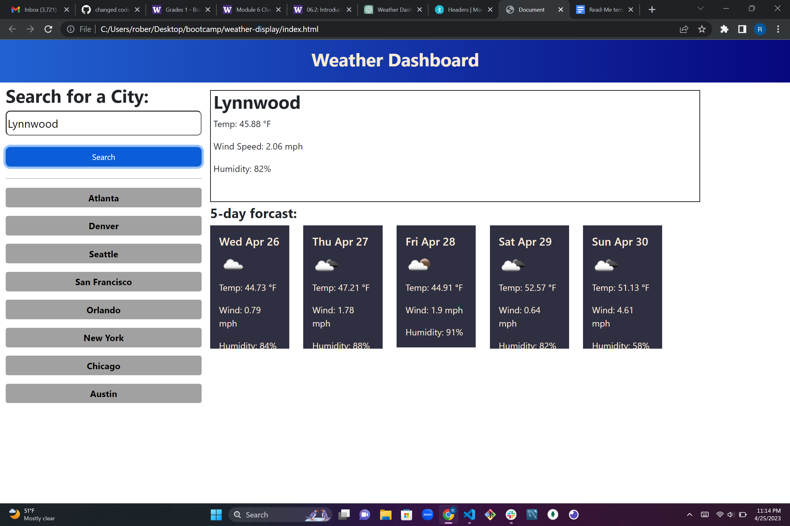
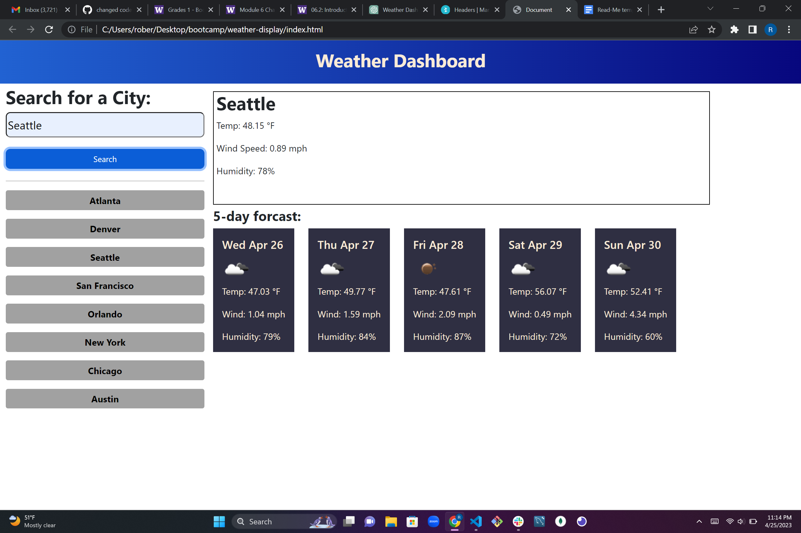

# weather-display

## Table of contents
​
- [Overview](#overview)
 - [The challenge](#the-challenge)
 - [Screenshot](#screenshot)
 - [Links](#links)
- [My process](#my-process)
 - [Built with](#built-with)
 - [What I learned](#what-i-learned)
 - [Continued development](#continued-development)
 - [Useful resources](#useful-resources)
- [Author](#author)
- [Acknowledgments](#acknowledgments)
​
## Overview
​
### The challenge
​
Users should be able to:
​
- Know how to use APIs, requests a key, impliment it into Javascript
- Use Javascript and Jquery to change the HTML and add events
- Impliment CSS to formating
- Create a HTML file using proper layout
​
### Screenshot
​

​
### Links
​
- GitHub repo URL: [appleschaussaa](https://github.com/appleschaussaa/weather-display)
- Solution URL: [Deployed Weather Display](https://appleschaussaa.github.io/weather-display/)
​
## My process
​
### Built with
​
- Semantic HTML5 markup
- CSS custom properties
- Javascript and Jquery
- APIs
​
### What I learned
​
Upon going back to this project it was kind of stunning what we were supposed to be able to do with the current amount of knowledge I had at the time. I have been going back to this code on and off trying to get it to work while keeping as much of the old code as possible which was challenging because I did not even do the button events correctly let alone get the data to display correctly. The 5 day forecast turned out to be a total pain getting the data returned from the API to show inside the HTML card I already had. Eventually I stumbled upon the technique to just get it to display in a for loop and jquery to append it to the container which emptied everytime the function is called. I left the old HTML just because it looked nice than blank space.
​
### Continued development

Not going to lie, I was a little burnt out by the time I got the searched city results to show that is was overwhelming to get the set city buttons to work so that would be my next objective to develop. Adding some spice to the design and media responsivness would be nice as well.
​
### Useful resources
- [Example resource 1](https://getbootstrap.com/docs/5.1/layout/grid/) - all of Bootstrap is very nice but when it comes to creating many container/rows/collumns this is very nice
- [Example resource 2](https://developer.mozilla.org/en-US/docs/Web/CSS/gradient/linear-gradient) - helped with color change in the top banner
- [Example resource 3](https://coding-boot-camp.github.io/full-stack/apis/how-to-use-api-keys) - life saver for figuring out the weather API
- [Example resource 4](https://www.w3schools.com/howto/howto_js_temperature_converter.asp) - After a bit of confusion I realized the temp was showing in Kelvin and this helped with converting it
- [Example resource 5](https://www.w3schools.com/jquery/html_append.asp) - Helped give the idea to append as the data is looped
​
## Author

 Robert Schauss
- GitHub - [appleschaussaa](https://github.com/appleschaussaa)
​
## Acknowledgments
​
I will always be thankful of Shane for being an excellent instructor and breaking down topics nicely and all the TAs for always jumping around breakout rooms and assisting on issues that may occur. 